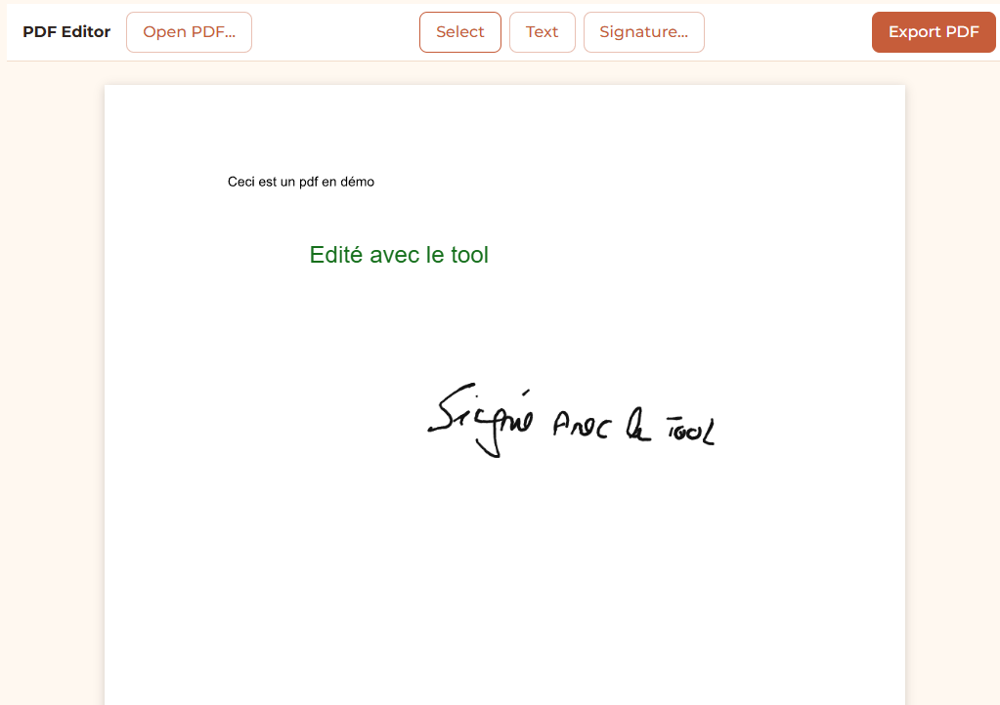

# Éditeur PDF : remplir et signer un PDF sans l'envoyer nulle part

**[▶ Essayer la démo](https://exzitech.github.io/editeur-pdf/)** · TypeScript · React · pdf.js · pdf-lib · Konva



Ouvrir un PDF, y placer du texte et une signature manuscrite, exporter le
résultat. Tout se passe **dans le navigateur ou l'application** : le document ne
quitte jamais la machine. C'est la différence avec les services en ligne gratuits,
à qui l'on confie des contrats, des baux ou des pièces d'identité.

## Ce que fait l'outil

- Affichage fidèle des pages (pdf.js), mis à l'échelle automatiquement.
- Zones de texte déplaçables et redimensionnables, couleur et taille réglables.
- Signature dessinée à la souris ou au doigt (tracé net sur les écrans haute densité).
- Export d'un vrai PDF (pdf-lib) : le texte ajouté reste du texte, pas une image
  de la page, et le document d'origine est conservé tel quel.

## Points techniques

- **Deux bibliothèques, un seul repère.** pdf.js affiche, pdf-lib écrit, et Konva
  gère l'édition à l'écran. Chacune a son système de coordonnées (origine en haut
  ou en bas, points ou pixels, zoom). La conversion est centralisée dans
  [`src/pdf/coords.ts`](plugins/pdf-editor/src/pdf/coords.ts), pour qu'un élément exporté tombe exactement où on l'a posé.
- Worker pdf.js embarqué dans le bundle et lancé depuis un Blob : l'outil tient
  dans un seul fichier, sans chemin à résoudre à l'exécution.

## Lancer en local

```
npm install
npm run dev
```

## Contexte

C'est l'un des plugins d'[ExziHub](https://github.com/Exzitech), une application
de bureau (Tauri). Dans l'application, « Exporter » ouvre la boîte « Enregistrer
sous » du système ; dans cette démo, le navigateur télécharge le fichier.

Licence MIT.
